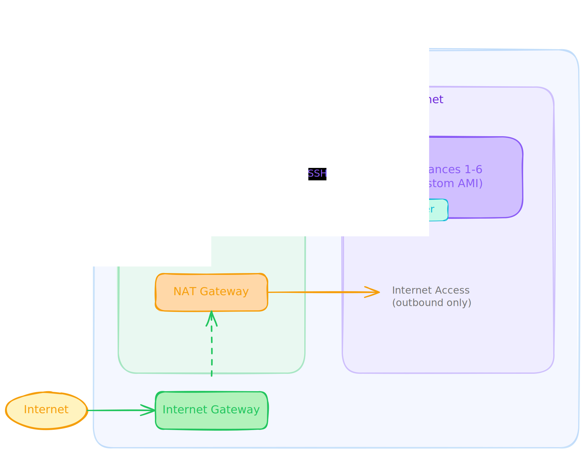
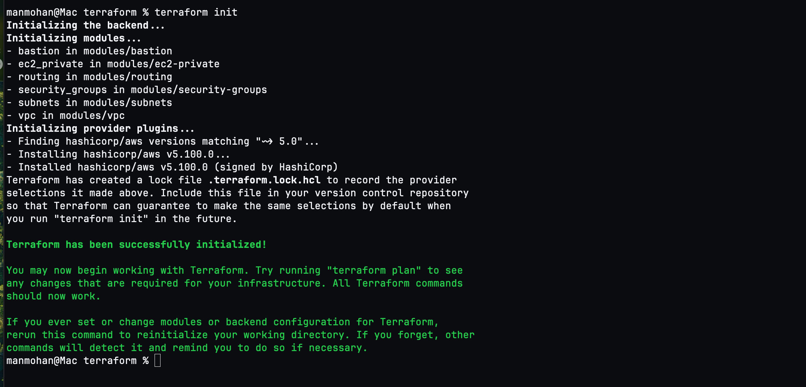
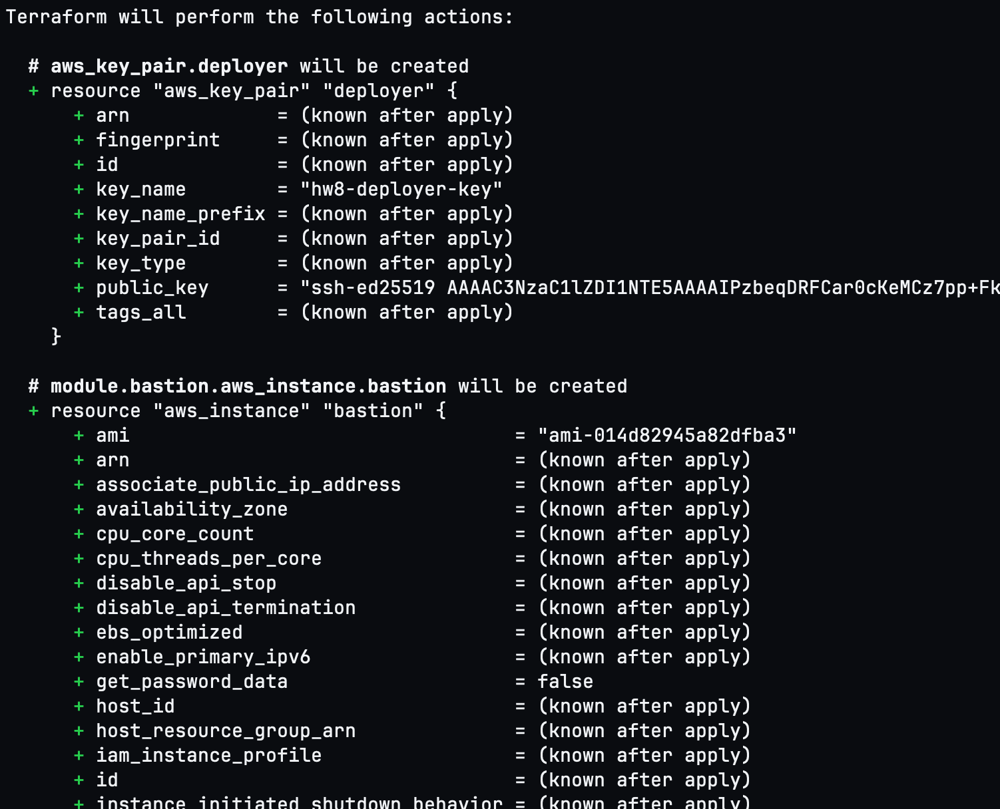
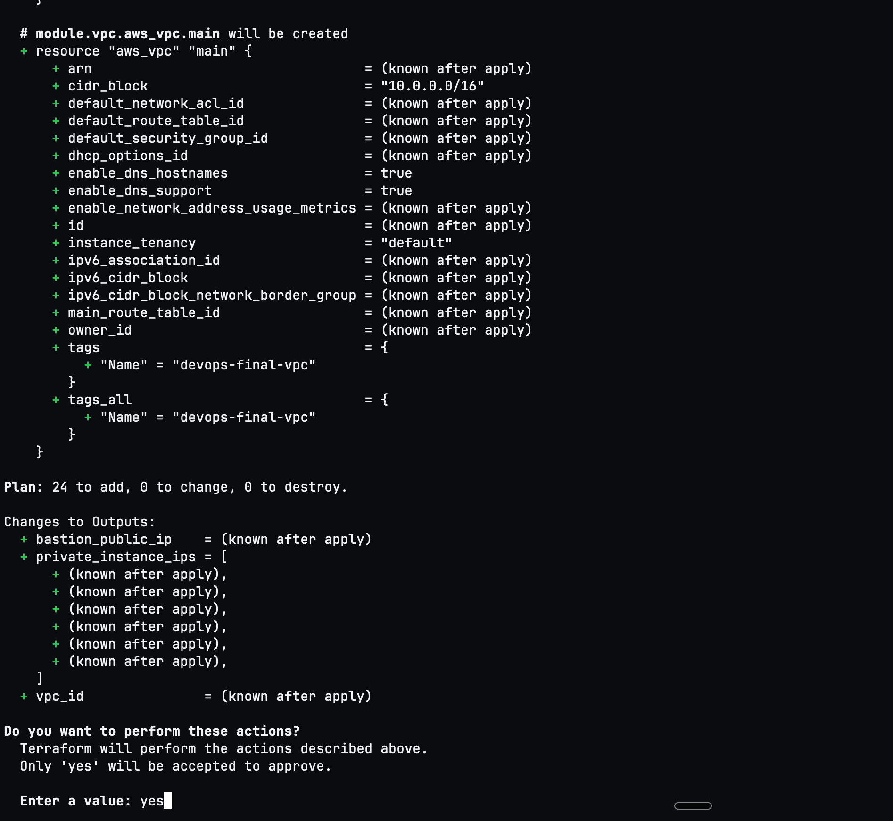
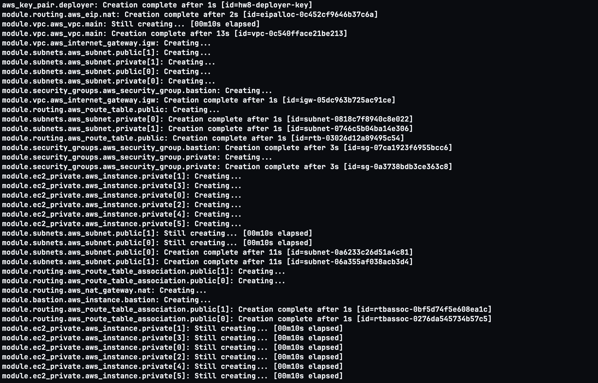
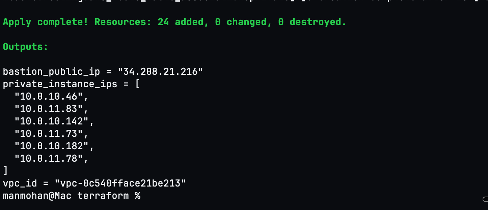
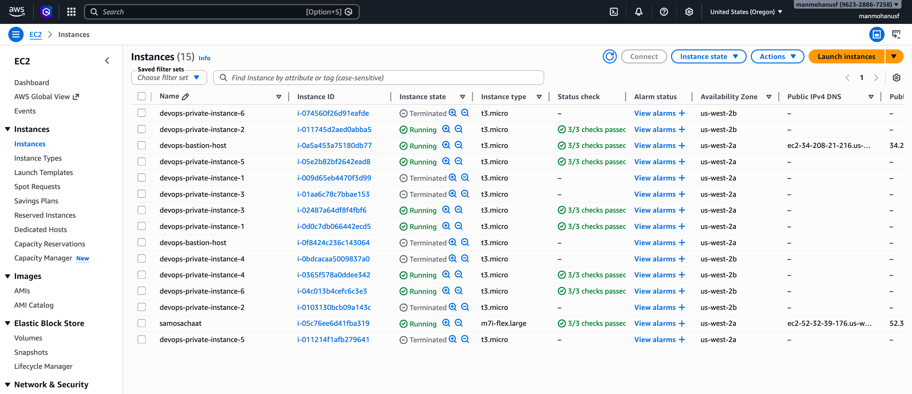
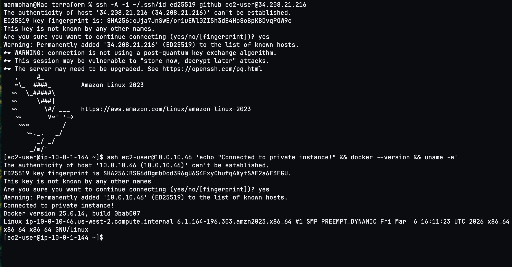
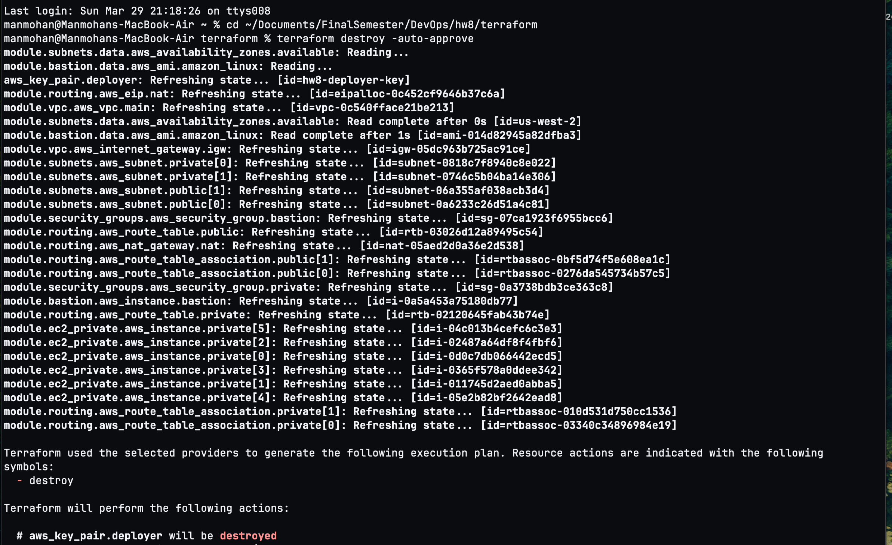

# AWS Infrastructure with Packer & Terraform

This project provisions a secure AWS infrastructure using **Packer** for custom AMI creation and **Terraform** for infrastructure-as-code deployment.

## Architecture



## What Gets Created

| Resource | Details |
|----------|---------|
| **Custom AMI** | Amazon Linux 2023 + Docker + SSH key (via Packer) |
| **VPC** | `10.0.0.0/16` with DNS support enabled |
| **Public Subnets** | 2 subnets across AZs (`10.0.1.0/24`, `10.0.2.0/24`) |
| **Private Subnets** | 2 subnets across AZs (`10.0.10.0/24`, `10.0.11.0/24`) |
| **Internet Gateway** | Attached to VPC for public subnet internet access |
| **NAT Gateway** | In public subnet for private subnet outbound internet access |
| **Bastion Host** | 1x `t3.micro` in public subnet (SSH from your IP only) |
| **Private Instances** | 6x `t3.micro` in private subnets using custom Packer AMI |
| **Security Groups** | Bastion: port 22 from your IP only; Private: port 22 from bastion SG only |

## Prerequisites

- AWS CLI configured with credentials (`aws configure`)
- [Packer](https://developer.hashicorp.com/packer/install) installed
- [Terraform](https://developer.hashicorp.com/terraform/install) installed
- An SSH key pair (Ed25519 recommended)

### Install Packer & Terraform (macOS)

```bash
brew tap hashicorp/tap
brew install hashicorp/tap/packer
brew install hashicorp/tap/terraform
```

## Step 1: Build the Custom AMI with Packer

```bash
cd packer

# Initialize Packer plugins
packer init ami.pkr.hcl

# Validate the template
packer validate ami.pkr.hcl

# Build the AMI
packer build ami.pkr.hcl
```

After the build completes, Packer outputs the AMI ID. Copy it and paste into `terraform/terraform.tfvars` as `custom_ami_id`.

## Step 2: Deploy Infrastructure with Terraform

### Initialize Terraform

```bash
cd terraform
terraform init
```



### Plan and Review

```bash
terraform apply
```

Terraform shows all 24 resources it will create including VPC, subnets, route tables, NAT gateway, security groups, bastion host, and 6 private instances:





Type `yes` to approve.

### Resources Creating



### Deployment Complete

All 24 resources created successfully. Terraform outputs the bastion public IP and all 6 private instance IPs:



## Step 3: Verify in AWS Console

After deployment, all 7 instances (1 bastion + 6 private) are visible and running in the EC2 console:



## Step 4: Connect to Private Instances via Bastion

The same SSH key is used for both bastion and private instances. Use SSH agent forwarding to hop through the bastion.

### SSH to Bastion, then hop to Private Instance

```bash
# Start SSH agent and add key
eval "$(ssh-agent -s)"
ssh-add ~/.ssh/id_ed25519_github

# SSH to bastion with agent forwarding
ssh -A -i ~/.ssh/id_ed25519_github ec2-user@<BASTION_PUBLIC_IP>

# From bastion, hop to any private instance
ssh ec2-user@<PRIVATE_INSTANCE_IP>

# Verify Docker
docker --version
```



The screenshot shows:
1. SSH into the bastion host at `34.208.21.216` (Amazon Linux 2023)
2. From the bastion, SSH hop to private instance `10.0.10.46`
3. Docker version `25.0.14` confirmed on the private instance

## Cleanup

To avoid ongoing AWS charges, destroy all resources:

```bash
cd terraform
terraform destroy
```



Then optionally deregister the Packer AMI from the AWS Console (EC2 > AMIs).

## Project Structure

```
hw8/
├── packer/
│   ├── ami.pkr.hcl              # Packer template for custom AMI
│   └── scripts/
│       └── setup.sh             # Provisioning script (Docker + SSH key)
├── terraform/
│   ├── main.tf                  # Root module - wires all modules together
│   ├── variables.tf             # Input variables
│   ├── outputs.tf               # Output values
│   ├── terraform.tfvars         # Variable values (edit before applying)
│   └── modules/
│       ├── vpc/                 # VPC + Internet Gateway
│       ├── subnets/             # Public + Private subnets
│       ├── routing/             # Route tables + NAT Gateway
│       ├── security-groups/     # Bastion SG + Private SG
│       ├── bastion/             # Bastion host EC2
│       └── ec2-private/         # 6 private EC2 instances
├── screenshots/                 # Deployment evidence
├── .gitignore
└── README.md
```
